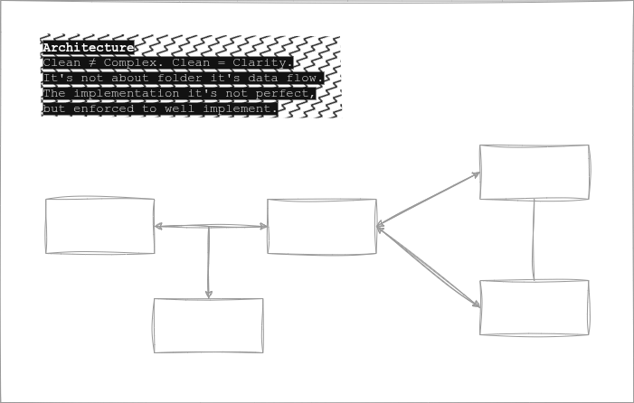

# Rekomendasiin Super App Backend  

I will do with Behavior-driven development (BDD/TDD) with Waterfall Method. This is a store app, but it's not a multi tenant app!. Thread you as a master not a slave like another app!. This is just tool, That you can use. I Mean the whole app, not just the BE only, if just BE, it's also sucks!.

## Architecture



## Progress  

- [x] Auth  
  - [x] Google Auth (OAuth2)
  - [ ] ~~Firebase Auth (Phone Number)~~
  - [x] Bearer Auth
  - [x] Magic Link (Concept, verification Only)
  - [x] OTP (verification Only)
- [x] Prisma ORM (Concept) - new generator.
- [x] SMTP
- [x] Bundler (Rollup)
- [x] Logger
- [x] Containerize app
- [x] Email Template
- [x] Express Router Wrapper
- [x] DevEx
  - [x] React Email (Email Tooling)
  - [x] Docker (Containerization)
  - [x] Bruno API Client
  - [x] Resend (SMTP Server)
  - [x] Prisma (Database ORM)
  - [x] Vite Build (Bundler)
  - [x] Vitest (Unit Test)
  - [x] Biome (Linter)
  - [x] Husky (commit hook)

## Planned

- [ ] Event (Async Service)
- [ ] Payment Module (Payment Gateway Integration)
- [ ] Product (App Feature) - In Progress 🏗️
- [ ] LLM Invocation (AI) - In Progress 🏗️
- [ ] RBAC/ABAC (Owner, Billing, Admin, User)
- [ ] Security Best Practice 🏗️
- [ ] Unit Test - In Progress 🏗️
- [ ] E2E Test
- [ ] Swagger API Documentation
- [ ] Semi Micro Service (Concept)
- [ ] GRPC
- [ ] REST APIs 🏗️
- [ ] Websocket

## Build  

```shell
# On Builder
pnpm install
pnpm build
# because the repository using husky as git hook
# so it may unset first the prepare script
# read : https://joshtronic.com/2022/07/10/husky-command-not-found-with-npm-install-production/
cd dist
pnpm pkg set scripts.prepare=" "
pnpm install --production --shamefully-hoist

# On runner
node index.js
```

---

@rpratama-codes  
Readable, Maintainable, Future Proof!.
